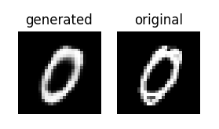

# Reconstruction of MNIST data with AutoEncoder - TensorFlow

The `MNIST` dataset is a popular datast of handwritten digits. It includes 60,000 samples for training machine learning models, and 10,000 samples for evaluating and testing the performance of these models. In this project I trained a `AutoEncoder` model with `MNIST` dataset, such that it can reconstruct the handwritten digits. Used `Conv2D`, `Conv2DTranspose`, `Maxpool2D`, and `Upsampling2D` layers to build my model. Training is done using `GPU P100` from kaggle.
You can check my kaggle notebook [here](https://www.kaggle.com/code/kavyas1996/mnist-reconstruction-ae)

### Try this implementation

I've added the trained AutoEncoder model to `src` directory. To run this repo you need to clone and install all the requirements. After that open your terminal, check into repo directory and enter the given command-line instruction.

**Requirements**
- numpy 
- TensorFlow
- matplotlib

```
python3 run.py --idx index_number
```
mnist has 10000 test samples. So you can select any index_number varying from 0 to 9999.

**example :**

```
python3 run.py --idx 993
```
**output**


